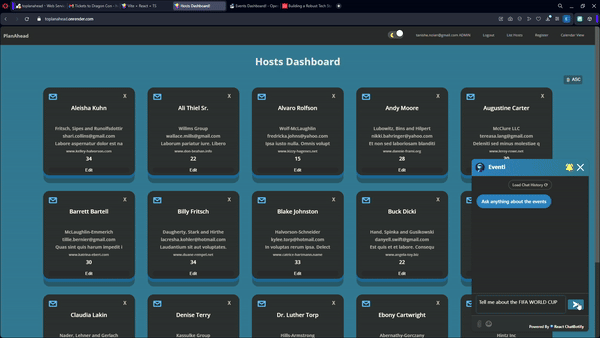

# PlanAhead

## An event management app for Event Hosts

### Users can view their events, promote them to other event hosts and sell tickets to their events

- Technologies - Backend: `Java Spring Boot, PostgreSQL, JWT tokens for security`
- Frontend: `React with Vite`

## APP FEATURES

### Login Page

### Hosts Dashboard with Interactive 3D Buttons

### Manage Hosts and Events with interactive forms

### Manage your events with the built-in Calendar

### Manage your events in List View with interactive Map Location

### View event statistics in an interactive Chart (ex: Days with most events)

### Choose your preffered theme with the click of a button (Light vs Dark)

### VS

### Interact with our AI Chatbot Eventi to find out more about the events you want to attend

### Send exclusive event invites to the other hosts for one of your events

### The user that receives the email can purchase a ticket

### And receives the ticket in the mail

### The app sends notifications in the day of the event

#

### USERS have roles: USER, MANAGER, ADMIN

- only MANAGERS AND ADMINS are allowed to create, update or delete entities
- only ADMINS are allowed to change the role of a host
- USER role allows to view your own events and to send invites to other hosts
